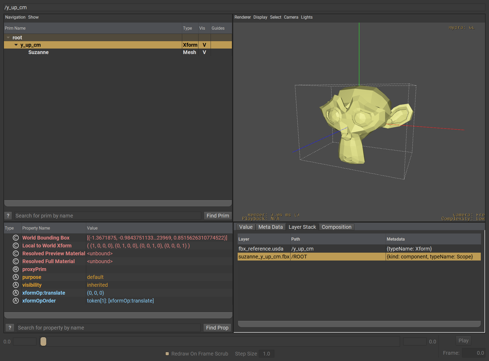
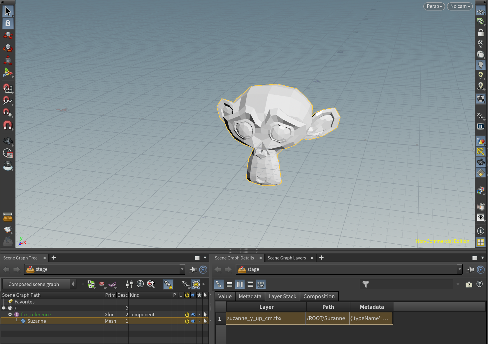

# usdFbx

This project is an `SdfFileFormat` plugin for [USD][USD_URL] to enable loading and composing of Autodesk Fbx files inside USD layers. The project configures a standalone version and/or a plugin built specifically for Houdini.

MayaUSD is supported, but only a locally built version of MayaUSD has been tested so far. Using the USD libraries that come with published builds of MayaUSD should theoretically work; however, this is uncharted territory.

The plugin is based on the Alembic example bundled with the USD sources so there are a lot of similarities. In the future, this project may receive a refactor to simplify things.

# Capabilities and Limitations

1) Support for the following FBX Node Types
    - `FbxNodeAttribute::eNull`
    - `FbxNodeAttribute::eMesh`
    - `FbxNodeAttribute::eSkeleton`
    - `FbxNodeAttribute::eCamera`
2) Materials are not yet supported but are on the near future roadmap
3) Custom FBX Properties convert into USD properties prefixed with the `userProperties:` property namespace. The `Custom` Metadatatum will also be set for these
4) While access to the fileformat itself by USD is multithreaded, any dealings with the FBX SDK itself is single threaded at the moment
5) Per bone animated properties are recorded to a set of custom properties onto a `UsdSkelAnim` prim
6) The plugin does not and will not support any writing capabilities back into FBX from USD. Editing FBX data is recommended to be done on a new sublayer/edittarget
7) All FBX scenes will be converted to Y-up, 0.01 metersPerUnit (cm)

# Requirements

| Software/Library | Version |
| --- | --- |
| [USD][USD_URL] | 22.08 or later|
| [Python](https://www.python.org/downloads/) | 3.7+ |
| C++ Compiler | Visual Studio (Win), Gcc (Linux), Xcode (Mac) |
| [CMAKE](https://cmake.org/download/) | 3.20+ |
| [Fbx SDK][FBX_SDK_URL] | 2017.1+ (2020.x is recommended) |
| **\[Tests Only\]** Fbx Python Bindings | Any that works with the Python version used |
| **\[Houdini Only\]** Houdini Developer Kit | 19.0+ |

# Compiling

The project has been configured with CMAKE, configuration can be done via command line, CMAKE GUI or inside IDEs with integrated CMAKE support.

The important CMAKE Variables to set are
- `PXR_USD_LOCATION`: Root directory of the installed USD distribution
- `ADSK_FBX_LOCATION`: Root Directory of the C++ FBX SDK
- `USDFBX_BUILD_TESTS`: Setting this to `ON` will create a `unit_tests` target
- `SIDEFX_HDK_LOCATION`: Root Directory of the Houdini Development Kit. When setting this, a new target called `usdFbx_houdini` will be added

## Note on Python
It is recommended to activate and use a Python Virtual Environment (venv, pipenv, conda, etc.) prior to running the CMAKE configuration. When doing so, it's best to pass  `-DPython_FIND_VIRTUALENV=ONLY` to the CMAKE command to minimize any issues with CMAKE's `FindPython`


## Note on `USDFBX_BUILD_TESTS`
The configuration will check for the existence of `pytest` on current path. Therefor it is recommended to use a Python Virtual Environment ([pipenv](https://pypi.org/project/pipenv/) to make it easy) prior to configuring with this flag enabled.

## Examples

### Basic

```powershell
cmake -B build -G "Visual Studio 17 2022" -T host=x64 -A x64 -DPXR_USD_LOCATION="C:\USD\23.05" -DADSK_FBX_LOCATION="C:\Program Files\Autodesk\FBX\FBX SDK\2020.3.4" -DCMAKE_INSTALL_PREFIX="$(Resolve-Path .)\install"
```

## Using Pipenv

```powershell
pipenv --python 3.9
pipenv install pytest pytest-order python-dotenv pytest-mock
pipenv install <PATH TO FBX SDK PYTHON PACKAGE>
pipenv shell
cmake -B build -G "Visual Studio 17 2022" -T host=x64 -A x64 -DPXR_USD_LOCATION="C:\USD\23.05" -DADSK_FBX_LOCATION="C:\Program Files\Autodesk\FBX\FBX SDK\2020.3.4" -DPython_FIND_VIRTUALENV=ONLY -DUSDFBX_BUILD_TESTS=ON -DCMAKE_INSTALL_PREFIX="$(Resolve-Path .)\install" 
```

# Running Tests
Tests have been written in pytest and requires a Python environment with the following dependencies installed:

- [Python FbxSDK][FBX_SDK_URL]
- `pytest`
- `pytest-order`
- `python-dotenv`
- `pytest-mock`

With this environment active, running the tests can be done by using CMAKE via the `unit_tests` target 
```bash
cmake --build ./build --config RelWithDebInfo --target unit_tests -j 32
```

Or manually by invoking `pytest tests`.

When running tests manually however, it is important that you have the following environment variables set correctly:
- `PYTHONPATH`: `<USD_DIR>/lib/python`
- `PATH`: `<USD_DIR>/lib;<USD_DIR>/bin;${PATH}`
- `PXR_PLUGINPATH_NAME`: `<USDFBX_DIR>/build/plugins/usdFbx/<CONFIG>/resources`

Where `<USD_DIR>` is the location of where USD has been installed to, `<USDFBX_DIR>` is the local clone of this repository and `<CONFIG>` is the configuration used to build `usdFbx`.  
The CMAKE `unit_tests` target does all of the above automatically

> 📝 **NOTE**    
Most test fixtures generate Fbx data rather than rely on static data. For that, you must have the Fbx python SDK (not the bindings) in `PYTHONPATH` somewhere or have it installed in your environment.    


# Using the Plugin

Both examples below use the following USD Layer

```
#usda 1.0

def "y_up_cm"
(
    prepend references = @./suzanne_y_up_cm.fbx@
)
{
}

```

Where `suzanne_y_up_cm.fbx` is a Y-Up, cm scale FBX export of [Blender](https://www.blender.org/download/)'s Suzanne mascot.

When using the Python/C++ API for USD you may also simply use `Usd.Stage.Open("suzanne_y_up_cm.fbx")`/`UsdStage::Open("suzanne_y_up_cm.fbx")` rather than wrapping in a native USD layer.

## USDVIEW
Add `<PATH TO INSTALLED USDFBX/RESOURCES>` to your `PXR_PLUGINPATH_NAME` environment variable in addition to setting up a shell the normal way for using USD.
After this run `usdview <PATH TO LAYER>` where `<PATH TO LAYER>` points to for example the layer mentioned above.


> 📝 **NOTE**    
If your build of USD has changed the plugin search environment variable, use that instead of `PXR_PLUGINPATH_NAME`!    

> 📝 **WINDOWS ONLY**    
Currently, the FBX SDK is dynamically linked, meaning that you must also add `<PATH TO INSTALLED USDFBX>` to your `PATH` environment variable! Not doing so will result in `moduleNotFound` errors.




## HOUDINI

> 📝 **NOTE**    
You must have configured CMAKE with `SIDEFX_HDK_LOCATION` to be able to use the Houdini plugin!


Simply add `<PATH TO INSTALLED USDFBX_HOUDINI/RESOURCES>` to your `PXR_PLUGINPATH_NAME` environment variable and launch Houdini from the same shell. You can then add a reference/sublayer/etc... the layer above, or point directly to an fbx.




[USD_URL]: https://github.com/PixarAnimationStudios/USD
[FBX_SDK_URL]: https://www.autodesk.com/developer-network/platform-technologies/fbx-sdk-2020-3-4